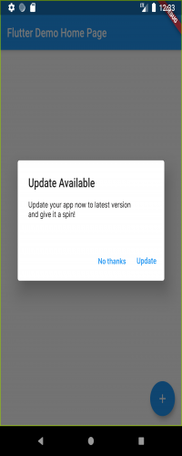

# App Update Alert Plugin 🎉y

With the help of a this Flutter plugin.
* Check if a user has the most recent installation of your app.
* Display a message to the user with a link to the relevant app store page.

See more at the [Dart Packages page.](https://pub.dev/packages/app_update_alert)



## Installation
Add new_version as [a dependency in your `pubspec.yaml` file.](https://flutter.io/using-packages/)
```
dependencies:
  app_update_alert: ^1.0.3
```

## Usage
Create an instance of `AppUpdate` in `main.dart` (or wherever your app is initialised).

`final appUpdate = AppUpdate();`

Your Flutter package identification will be used by the plugin automatically to search the app store. You can overwrite this identity if your app uses a different one on the Google Play Store or Apple App Store by giving values for `androidPackageName` and/or `iosPackageName.`

*For iOS:* You must specify `iOSAppStoreCountry` to the two-letter country code of the Software Store you want to search if your app is only accessible outside the India. A list of ISO Country Codes can be found at http://en.wikipedia.org/wiki/ISO 3166-1 alpha-2.


### Quickstart
Calling `showUpdateAlert` with your app's `BuildContext` will check if the app can be updated, and will automatically display a platform-specific alert that the user can use to go to the app store.

`appUpdate.showUpdateAlert(context: context);`
